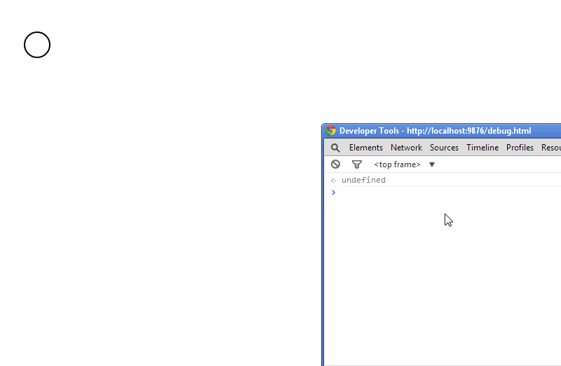

> As of version `1.0.0` this library exposes [ES modules](http://exploringjs.com/es6/ch_modules.html#sec_basics-of-es6-modules). Use an ES module aware bundler such as [Webpack](https://webpack.js.org) or [Rollup](https://rollupjs.org) to bundle it for the browser.

# bpmn-js-cli

[](https://travis-ci.org/bpmn-io/bpmn-js-cli)

An extensible command line interface for [bpmn-js](https://github.com/bpmn-io/bpmn-js).


## Demo



Checkout [`demo.js`](./resources/demo.js) for the commands powering this demo.


## Features

* Model BPMN 2.0 diagrams in the browser, without a mouse
* Full undo and redo functionality
* Extensible through your own commands
* [Numerous built-in commands](#built-in-commands)


## Built in Commands

Out of the box, the cli supports the following commands:

 * `append source type [deltaPos]`
 * `connect source target type`
 * `create type position parent`
 * `element id`
 * `elements`
 * `move shape delta [newParentId]`
 * `undo`
 * `redo`
 * `save svg|bpmn`
 * `setLabel element label`
 * `removeShape  shape|elementId`
 * `removeConnection  connection|connectionId`


## Quickstart

Get the list of available commands:

```
cli.help();
```

Get the list of shapes:

```
cli.shapes();
```

Export SVG or BPMN 2.0 xml

```
cli.save('svg' || 'bpmn');
```


## Usage

Deploy the cli with [bpmn-js](https://github.com/bpmn-io/bpmn-js):

```
var BpmnModeler = require('bpmn-js/lib/Modeler'),
    CliModule = require('bpmn-js-cli');

var modeler = new BpmnModeler({
  container: document.body,
  additionalModules: [
    CliModule
  ],
  cli: {
    bindTo: 'cli'
  }
});

modeler.importXML('some-bpmn-xml');
```

Access the cli as `cli` in your developer console (open via `F12` in most browsers).

Use the cli to model BPMN 2.0 diagrams in your browser. Pain free.


## License

MIT
